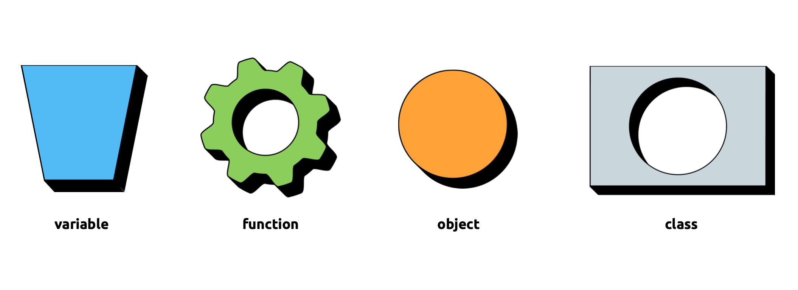

# Essential Computing using Java

*Author: [Carl Emil Carlsen](http://cec.dk)*

Slides produced in 2019 for teaching Essential Computing using Java at Roskilde University (RUC), HumTek, over the course of one semester. It is aimed at students with little or no programming experience and is meant to be accompanied by the book [Think Java](http://www.amazon.com/gp/product/1491929561). Emphasis is put on core programming concepts, reflected by the fact that the students rely on no other UI than [NetBeans IntelliJ IDEA](https://www.jetbrains.com/help/idea/netbeans.html) and the terminal.

The material is put out here n the case other teachers want to reuse or be inspired by some of it.

### Personal notes

Java is by no means my favorite programming language, it just happens to be what they use at RUC HumTek. Also, this is possibly the first and last course I will teach that does not involve audiovisual interaction. The great challenge for me designing this course was to keep the learning experience entertaining and motivating for the students while being restricted to the terminal interface. Judging from feedback from the students, I believe that I succeeded for the most part. Some students requested bonus assignments. It was also suggested that the hints mentioned in each micro assignment would benefit from an introductory overall strategy.

### Content

The slides are grouped into programming concepts and micro assignments. The intention is to work in very short cycles of theory and practice, where programming concepts are introduced using the slides and then immediately experimented with using the micro assignments.

### Topics

- Java
- Methods
- Variables & Datatypes
- Printing
- Scanner
- Operators
- Modulo
- Errors
- Math
- Literals & Constants
- Casting
- Methods with arguments
- Relational operators
- Conditionals
- Logical operators
- Validation & Sanity
- Recursion
- Documentation
- Binary
- Value methods
- Loops
- Arrays
- Value & reference type
- Strings
- Classes & Objects
- Constructor & special methods
- Garbage collection
- Command-line arguments
- Static & non-static
- Information hiding
- Search
- Flowcharts

### License (MIT)

Copyright (c) 2019 Carl Emil Carlsen

Permission is hereby granted, free of charge, to any person obtaining a copy
of this software and associated documentation files (the "Software"), to deal
in the Software without restriction, including without limitation the rights
to use, copy, modify, merge, publish, distribute, sublicense, and/or sell
copies of the Software, and to permit persons to whom the Software is
furnished to do so, subject to the following conditions:

The above copyright notice and this permission notice shall be included in all
copies or substantial portions of the Software.

THE SOFTWARE IS PROVIDED "AS IS", WITHOUT WARRANTY OF ANY KIND, EXPRESS OR
IMPLIED, INCLUDING BUT NOT LIMITED TO THE WARRANTIES OF MERCHANTABILITY,
FITNESS FOR A PARTICULAR PURPOSE AND NONINFRINGEMENT. IN NO EVENT SHALL THE
AUTHORS OR COPYRIGHT HOLDERS BE LIABLE FOR ANY CLAIM, DAMAGES OR OTHER
LIABILITY, WHETHER IN AN ACTION OF CONTRACT, TORT OR OTHERWISE, ARISING FROM,
OUT OF OR IN CONNECTION WITH THE SOFTWARE OR THE USE OR OTHER DEALINGS IN THE
SOFTWARE.

